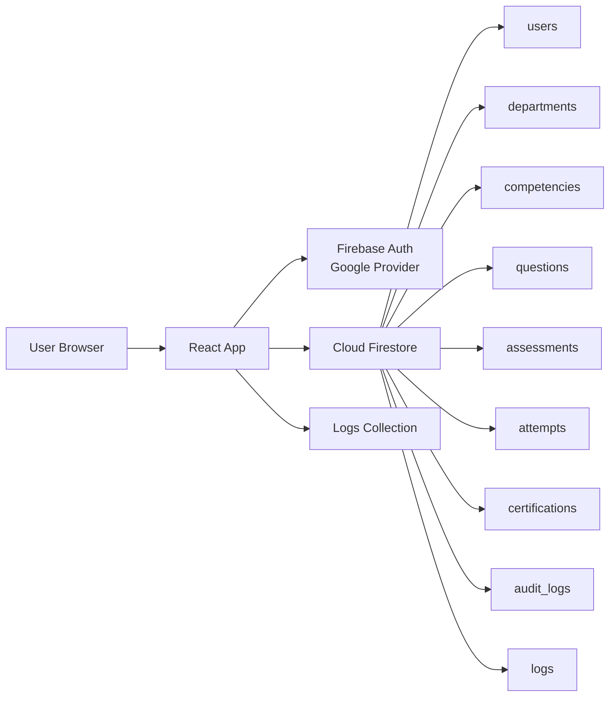

# Manav Rachna ICCF Portal

Institutional Competency Certification Framework (ICCF) portal built with React, TypeScript, Vite, and Firebase.

This application enables students to take competency assessments, receive certification outcomes, and track attempt history. Department heads and core team members can manage assessment workflows, including question moderation and baseline data setup.

## 1. What This Project Does

The ICCF portal is designed to support competency-based evaluation for university students.

Core capabilities:

- Google-authenticated sign-in.
- Role-aware dashboard and navigation.
- Competency-based assessments with configurable distribution.
- Real-time Firestore-backed data loading.
- Attempt scoring and certification status generation.
- Basic anti-cheating signal logging (for example, tab switch detection).
- Admin utilities such as question approval and seed data initialization.

## 2. Primary User Roles

Role behavior is enforced in both UI logic and Firestore rules.

- `student`
   - Can sign in, view dashboard, take assessments, and review own attempt history.
   - Gets certification status based on score threshold per assessment.

- `dept_head`
   - Gets management view access.
   - Can participate in question/assessment administration workflows.

- `core_team`
   - Full management visibility in the current implementation.
   - Includes a hardcoded bootstrap admin email pathway in app logic and security rules.

- `system_admin`
   - Present in type definitions for future expansion.

## 3. Tech Stack

- Frontend: React 19 + TypeScript
- Build tool: Vite 6
- Styling: Tailwind CSS v4 + utility helpers (`clsx`, `tailwind-merge`)
- Motion and charts: `motion`, `recharts`
- Notifications: `sonner`
- Auth and database: Firebase Authentication + Cloud Firestore
- Icons: `lucide-react`

## 4. High-Level Architecture



Runtime model:

1. User signs in via Google popup.
2. App checks `/users/{uid}` profile.
3. If user is new, app creates a user doc with inferred role (`student` by default, `core_team` for specific bootstrap email).
4. App subscribes to Firestore collections using real-time listeners.
5. Student assessment attempts are scored and persisted.
6. Logging utility writes operational and security events to Firestore `logs` collection.

## 5. Repository Structure

```text
.
|- src/
|  |- App.tsx                    # Main application flow, routing-by-state, role logic
|  |- main.tsx                   # React entry with global Error Boundary
|  |- firebase.ts                # Firebase initialization and exports
|  |- types.ts                   # Shared domain models
|  |- index.css                  # Global styles
|  |- components/
|  |  |- ErrorBoundary.tsx       # Global crash fallback UI + logging
|  |- lib/
|     |- logger.ts               # Firestore-backed structured logger
|     |- utils.ts                # Shared utility helpers
|- firestore.rules               # Firestore access control rules
|- firebase-applet-config.json   # Firebase client configuration used by app
|- firebase-blueprint.json       # Data model blueprint / schema descriptor
|- vite.config.ts                # Vite config + env injection
|- tsconfig.json                 # TypeScript compiler options
|- package.json                  # Scripts and dependencies
```

## 6. Firestore Data Model

The app works around a collection-based model.

- `/users/{uid}`
   - Stores identity and authorization profile: `email`, `role`, optional `department`, etc.

- `/departments/{id}`
   - Department metadata used for segmentation.

- `/competencies/{id}`
   - Competency definitions including `minimumScore` and department linkage.

- `/questions/{id}`
   - Question bank entries with approval workflow fields.

- `/assessments/{id}`
   - Assessment definitions with competency distribution and score thresholds.

- `/attempts/{id}`
   - Student attempt records, answers, per-skill scoring, overall score, certification status.

- `/certifications/{id}`
   - Issued certification snapshots for successful attempts.

- `/audit_logs/{id}`
   - Security- and compliance-oriented immutable logging stream.

- `/logs/{id}`
   - Operational logs emitted by `src/lib/logger.ts` (auth, admin actions, errors, security events).

## 7. Authentication and Authorization

Authentication:

- Google Sign-In popup through Firebase Auth provider.
- Auth state listener (`onAuthStateChanged`) controls app session state.

Authorization:

- UI-level role checks conditionally show student/admin views.
- Firestore rules implement server-side enforcement for reads and writes.

Bootstrap admin behavior:

- A specific email is treated as `core_team` during first profile creation.
- Rules also include a verified-email shortcut for the same address.

Production recommendation:

- Replace hardcoded email checks with a role assignment workflow (for example, Cloud Function + custom claims or managed admin panel).

## 8. Local Development Setup

### Prerequisites

- Node.js 20+ (recommended LTS)
- npm 9+
- Firebase project with Authentication and Firestore enabled

### Install

```bash
npm install
```

### Environment Variables

Create a local env file (`.env.local`) if needed:

```bash
GEMINI_API_KEY=your_key_here
```

Notes:

- `GEMINI_API_KEY` is injected in `vite.config.ts`.
- Current UI paths in this repo do not rely on Gemini API calls directly, so this can be optional unless you add AI-backed features.

### Firebase Configuration

The app reads Firebase client config from `firebase-applet-config.json`.

If you are running in your own Firebase project:

1. Create/choose a Firebase project.
2. Enable Google Authentication provider.
3. Create a Firestore database.
4. Replace values in `firebase-applet-config.json` with your project settings.
5. Deploy security rules from `firestore.rules`.

### Start Development Server

```bash
npm run dev
```

Default configured dev server target:

- Host: `0.0.0.0`
- Port: `3000`

## 9. Available Scripts

- `npm run dev`
   - Starts Vite development server.

- `npm run build`
   - Produces production build in `dist/`.

- `npm run preview`
   - Serves the production build locally for verification.

- `npm run clean`
   - Removes `dist/` directory.

- `npm run lint`
   - Runs TypeScript type checking (`tsc --noEmit`).

## 10. Operational Workflows

### Seed Baseline Data

The app includes a seed utility that creates sample departments, competencies, and a starter assessment.

Ways to trigger:

- From management UI: use the `Seed Data` action where available.
- From browser console in an authenticated session:

```js
window.handleSeedData?.();
```

### Question Moderation

Admin workflow supports approving/rejecting pending questions. The status field on question docs controls moderation state and selection eligibility.

### Attempt Evaluation

Assessment submissions calculate:

- Per-competency scores.
- Overall score.
- Certification result (`certified` or `failed`) based on assessment threshold.

## 11. Logging, Monitoring, and Error Handling

Centralized logging is implemented via `src/lib/logger.ts`:

- Categories include auth, assessment, database, security, admin, and error events.
- Entries are persisted to Firestore with a server timestamp.

Error handling highlights:

- `ErrorBoundary` wraps the app and displays a fail-safe fallback UI.
- Firestore operation wrappers emit contextual error metadata and user-facing toasts.

## 12. Security Notes

- Firestore security rules are present and role-aware.
- Always validate that rule field names align with your stored document schema.
- API keys in Firebase web config are not secrets, but they should still be scoped to approved origins and protected by backend rules.
- Restrict sign-in to institutional domains if required by policy.

Important hardening tasks before production rollout:

1. Remove or externalize hardcoded privileged email checks.
2. Add stronger anti-cheat controls if this is used for high-stakes certification.
3. Introduce backend validation for scoring integrity if trust boundaries require it.
4. Add audit review dashboards and retention policy.

## 13. Deployment Guidance

This is a static frontend app and can be hosted on services such as:

- Firebase Hosting
- Vercel
- Netlify
- Any static file server

Typical deployment sequence:

```bash
npm install
npm run lint
npm run build
```

Then deploy the generated `dist/` output with your hosting provider.

If using Firebase Hosting, also deploy Firestore rules as part of your release pipeline.

## 14. Troubleshooting

- Popup login blocked:
   - Allow popups for local origin and verify Firebase auth domain settings.

- Permission denied errors:
   - Confirm authenticated user role document exists in `/users/{uid}`.
   - Verify Firestore rules and field names.

- Blank UI after sign-in:
   - Check browser console for runtime errors and `logs` collection write failures.

- No assessment questions appearing:
   - Ensure question approval status and competency mapping are configured correctly.

## 15. Suggested Next Improvements

1. Split `App.tsx` into route-level and domain modules for maintainability.
2. Add unit and integration tests for scoring and access control.
3. Move admin/role bootstrap to backend-managed claims.
4. Introduce CI checks for type safety, linting, and security rule validation.
5. Add environment-specific config strategy (`dev`, `staging`, `prod`).

---

If this project is being used for official institutional assessments, treat this README as a baseline operations and engineering guide, and pair it with a formal security review and compliance checklist before full rollout.
